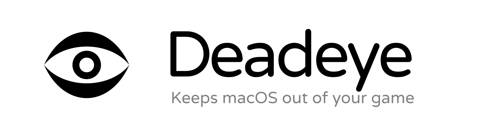

<div align="center">



No second cursor. No lost clicks. No menus over your game.

**Game mode for CrossOver, Whisky and Wine on Mac.**

[](https://github.com/inulute/deadeye/releases/latest)
[](#requirements)
[](https://support.inulute.com)

</div>

---

## The problems it fixes

If you play Windows games on a Mac, you have hit some of these:

- **Two cursors.** The macOS arrow shows up over your game and moves on its own,
  separate from your in-game crosshair.
- **Aiming near the top of the screen does nothing.** You right-click to aim, the
  menu bar takes the click, your game never gets it.
- **A menu opens over your game** mid-fight, from an app you never clicked.
- **The Dock slides in** at the screen edge and your camera stops turning.
- **A notch app draws over your HUD.**

None of it is your fault or the game's. It is macOS behaving normally around a
window it does not consider truly fullscreen.

## What you get

| Without Deadeye | With Deadeye |
|---|---|
| macOS arrow appears over your game | The arrow stays hidden. Only your crosshair is on screen. |
| Clicks near the top go to the menu bar | They go to your game. Aim-down-sights works up there. |
| Menus open over your game | Nothing opens. |
| The Dock eats your aim at the edge | The Dock stays down while you play. |
| Notch apps draw on your HUD | Quit while you play, reopened after. |

Deadeye turns on when a game starts and off when you quit. It puts every setting
back exactly as it found them.

**Nothing to configure.** Install it, grant one permission, play. No per-game setup.

> **How this relates to macOS Game Mode:** Apple's Game Mode handles performance,
> prioritising CPU and GPU and cutting controller latency, and it only starts for
> genuinely fullscreen games. Deadeye handles interruptions instead. It does not
> change your frame rate. The two work together, and neither replaces the other.

## Install

1. Download the latest [release](https://github.com/inulute/deadeye/releases/latest)
   and drag **Deadeye** to Applications.
2. Open it. macOS will refuse the first time, because Deadeye is not notarised. Go to
   **System Settings → Privacy & Security**, scroll to the bottom, and click
   **Open Anyway**.
3. Grant **Accessibility** when asked.

An eye appears in your menu bar. It blinks when a game starts and again when you
finish.

<details>
<summary>If there is no Open Anyway button</summary>

Some Macs report the app as damaged rather than offering to open it anyway. It is
not damaged. Clear the download quarantine and open it again:

```sh
xattr -dr com.apple.quarantine /Applications/Deadeye.app
```

That removes the quarantine flag and nothing else. If you would rather not run it,
[build Deadeye yourself](#build-it-yourself) instead: a few seconds, and it needs
only the Command Line Tools.
</details>

<details>
<summary>Why macOS complains at all</summary>

Deadeye is signed, but not notarised. Notarisation means uploading each build to
Apple for an automated malware scan, which requires a paid Apple Developer account
at $99 a year.

Without it macOS quarantines the download and asks you to confirm once. After that
it never asks again.

**Notarisation is the first thing donations will pay for.** It is the only thing
between this and an app that opens with no warning at all, so
[buying me a coffee](https://support.inulute.com) goes straight at it.
</details>

<details>
<summary>Why it needs Accessibility</summary>

To see a click before the menu bar does. There is no other way to stop that click,
and macOS gates the ability behind a permission.

It is the only permission Deadeye asks for. It sends nothing anywhere. The code
that uses it is three short files:
[`MenuBarShield.swift`](Sources/Deadeye/MenuBarShield.swift),
[`MenuBarVeil.swift`](Sources/Deadeye/MenuBarVeil.swift) and
[`CursorSuppressor.swift`](Sources/Deadeye/CursorSuppressor.swift).

If the permission is missing, Deadeye says so in its menu instead of silently
doing nothing.
</details>

## Requirements

- macOS 13 Ventura or later
- Apple Silicon or Intel
- A Wine-based way of running Windows games

## Compatibility

**Tested with [CrossOver](https://www.codeweavers.com/crossover).** That is what it
was built against and verified on.

**It should work with any Wine-based runner** (Whisky, Porting Kit, Game Porting
Toolkit) because it detects games by how Wine names its own processes, not by
looking for CrossOver. Two menu items are CrossOver-only: "Open CrossOver" and
"Check Game Settings".

Untested elsewhere, so not claimed. If you use another runner,
[open an issue](https://github.com/inulute/deadeye/issues) and say whether it
worked.

## Settings

You should not need them. Everything is on by default, so the menu is a status line
and one switch, with the rest under **Settings**.

**Hold back while playing:**

| | |
|---|---|
| **Menu bar clicks** | Sends clicks near the top to your game, and keeps the macOS arrow hidden. |
| **The Dock** | Stops its edge tracking stealing your pointer. |
| **Hot corners** | Stops a stray pointer throwing you into Mission Control. |
| **Overlay apps** | Quits notch apps and menu bar managers for the session. Which ones, in `Edit app list`. |

**Deadeye:** *Activate automatically* (leave it on) and *Launch at login*.

**Reset to recommended** turns all four hold-backs and automatic activation back
on. It leaves *Launch at login* alone, since that is a system login item rather
than a Deadeye setting.

**⌃⌥⌘G** toggles Deadeye from anywhere. Turning it off during a game keeps it off
for that game; automatic activation resumes at the next launch.

No bare ⌘-letter shortcuts, because games bind those and CrossOver passes them
through.

## Build it yourself

```sh
git clone https://github.com/inulute/deadeye
cd deadeye
./create-signing-identity.sh     # once, keeps Accessibility across rebuilds
./build.sh --install
```

Command Line Tools only, no Xcode. `./run-tests.sh` runs the tests.

The signing step matters: an ad-hoc signed app is identified by its binary hash, so
every rebuild would revoke its own Accessibility grant. A certificate keeps the
identity stable.

## Support

Deadeye is free and always will be.

- **[Buy me a coffee](https://support.inulute.com).** The first $99 goes on an Apple
  Developer account, so Deadeye can be notarised and open with no warning at all.
  After that, hosting and domains.
- **Star the repo.** Costs nothing, helps more than you would think.
- **Tell another Mac gamer.** At this stage that is worth more than money.

## Licence

Copyright (C) 2026 inulute.

Code is [GPL-3.0](LICENSE). You can read it, change it and redistribute it, as long
as your version stays open under the same licence, keeps the copyright notices, and
says what you changed.
